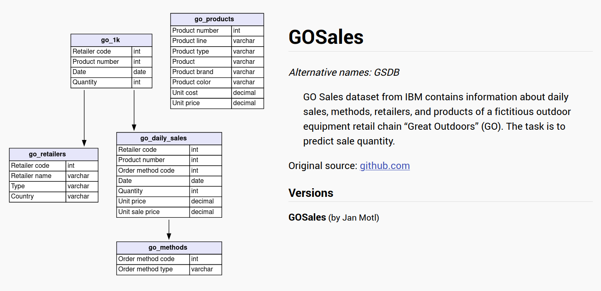

# Sobre a base de dados 

Encontrada no site [https://relational.fit.cvut.cz/dataset/GOSales](https://relational.fit.cvut.cz/dataset/GOSales).

Ela se encontra em CSV, e os CSVs podem ser encontrados para serem baixados em [https://github.com/IBM/watson-machine-learning-samples/tree/master/cloud/data/go_sales](https://github.com/IBM/watson-machine-learning-samples/tree/master/cloud/data/go_sales).

Nessa base de dados com 5 tabelas, ilustradas na imagem à seguir:



**Descrição da base de dados:** *"O conjunto de dados GO Sales da IBM contém informações sobre vendas diárias, métodos, varejistas e produtos de uma rede fictícia de varejo de equipamentos para atividades ao ar livre chamada "Great Outdoors" (GO). A tarefa é prever a quantidade de vendas."*


## Dicionário de dados 

Note como este documento é apenas um aquivo de log sobre a base de dados.

```
======== DAILY SALES ========

DailySales: 8756

retailer_code: INTEGER
Sample: [1209, 1209, 1283]

order_method_code: INTEGER
Sample: [1, 1, 1]

product_number: INTEGER
Sample: [76110, 87110, 124190]

quantity: INTEGER
Sample: [477, 267, 217]

date: DATETIME
Sample: [datetime.datetime(2018, 1, 16, 0, 0), datetime.datetime(2018, 5, 17, 0, 0), datetime.datetime(2016, 1, 20, 0, 0)]
Mean: 2016-07-07 03:58:47.638190848

unit_price: FLOAT
Sample: [40.52, 6.01, 43.85]

unit_sale_price: FLOAT
Sample: [39.71, 6.01, 43.85]

======== ONE K ========

OneK: 891

retailer_code: INTEGER
Sample: [1115, 1115, 1115]

product_number: INTEGER
Sample: [125110, 144180, 149140]

date: DATETIME
Sample: [datetime.datetime(2016, 2, 9, 0, 0), datetime.datetime(2016, 4, 21, 0, 0), datetime.datetime(2017, 2, 14, 0, 0)]
Mean: 2017-01-22 01:53:07.878788096

quantity: INTEGER
Sample: [46, 19, 11]

======== RETAILERS ========

Retailers: 562

retailer_code: INTEGER
Sample: [1101, 1115, 1123]

retailer_name: VARCHAR(100)
Sample: ['ActiForme', 'SportsClub', 'Anapurna']

type: VARCHAR(100)
Sample: ['Equipment Rental Store', 'Golf Shop', 'Direct Marketing']

country: VARCHAR(100)
Sample: ['France', 'France', 'France']

======== PRODUCTS ========

Products: 274

product_number: INTEGER
Sample: [1110, 2110, 3110]

product: VARCHAR(100)
Sample: ['TrailChef Water Bag', 'TrailChef Canteen', 'TrailChef Kitchen Kit']

product_line: VARCHAR(100)
Sample: ['Camping Equipment', 'Camping Equipment', 'Camping Equipment']

product_type: VARCHAR(100)
Sample: ['Cooking Gear', 'Cooking Gear', 'Cooking Gear']

product_brand: VARCHAR(100)
Sample: ['TrailChef', 'TrailChef', 'TrailChef']

product_color: VARCHAR(100)
Sample: ['Clear', 'Brown', 'Unspecified']

unit_cost: FLOAT
Sample: [2.77, 6.92, 15.78]

unit_price: FLOAT
Sample: [6.59, 12.92, 23.8]

======== METHODS ========

Methods: 12

order_method_code: INTEGER
Sample: [1, 2, 3]
```