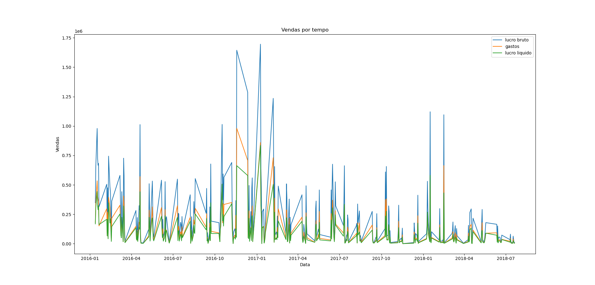
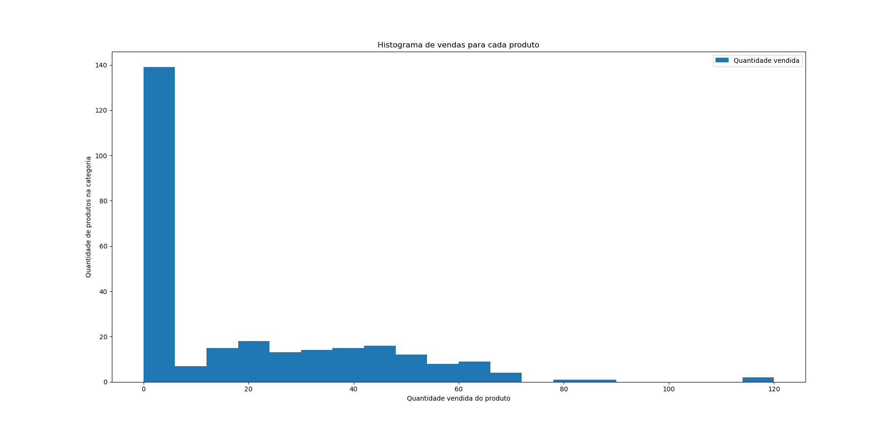

# Sobre a base de dados 

Encontrada no site [https://relational.fit.cvut.cz/dataset/GOSales](https://relational.fit.cvut.cz/dataset/GOSales).

Ela se encontra em CSV, e os CSVs podem ser encontrados para serem baixados em [https://github.com/IBM/watson-machine-learning-samples/tree/master/cloud/data/go_sales](https://github.com/IBM/watson-machine-learning-samples/tree/master/cloud/data/go_sales).

Nessa base de dados com 5 tabelas, ilustradas na imagem à seguir:


**Descrição da base de dados:** *"O conjunto de dados GO Sales da IBM contém informações sobre vendas diárias, métodos, varejistas e produtos de uma rede fictícia de varejo de equipamentos para atividades ao ar livre chamada "Great Outdoors" (GO). A tarefa é prever a quantidade de vendas."*


# Como fazer a limpeza de um dataset

Limpar um conjunto de dados envolve a remoção de dados indesejados, tratamento de valores ausentes, correção de erros e preparação dos dados para análise ou modelagem. 

## Etapas 

Aqui temos algumas etapas, bem como uma explicação de como executar-la com a biblioteca Pandas em Python:

### Identificar e lidar com valores ausentes
Verifique se há valores ausentes em seu conjunto de dados usando o método `isnull()` ou `isna()`.
Decida como lidar com os valores ausentes. Você pode remover as linhas ou colunas com valores ausentes usando `dropna()`, preencher os valores ausentes com `fillna()`, ou usar métodos mais avançados, como imputação de dados.

### Tratar dados duplicados
Verifique se há linhas duplicadas no conjunto de dados usando o método `duplicated()`.
Remova as linhas duplicadas usando `drop_duplicates()`.

### Lidar com erros e valores inconsistentes
Identifique e corrija erros e valores inconsistentes em seu conjunto de dados.
Use métodos como `replace()` ou expressões regulares para corrigir erros de digitação ou padronizar os dados.

### Converter tipos de dados
Verifique os tipos de dados das colunas e converta-os, se necessário.
Use métodos como `astype()` para converter os tipos de dados das colunas.

### Remover colunas desnecessárias
Identifique as colunas que não são relevantes para sua análise ou modelo e remova-as usando `drop()`.

### Renomear colunas
Renomeie as colunas, se necessário, para tornar os nomes mais descritivos ou padronizados, usando o método `rename()`.

Essas são apenas algumas etapas gerais para limpar um dataset. A complexidade da limpeza de dados varia de acordo com o conjunto de dados específico e os requisitos da análise ou modelo.


# Sistema montado

O sistema foi feito preparado para utilizar as seguintes tecnologias (formando o stack de ciência de dados desse projeto):

| tecnologia     | propósito                                                                        |
| -------------- | -------------------------------------------------------------------------------- |
| mysql          | base de dados cuja qual os dados são inseridos e onde serão puxados para análise |
| docker-compose | levanta um container de uma base de dados mysql local                            |
| python         | linguagem de programação que orquestra o sistema                                 |
| pymysql        | biblioteca de python que facilita o uso do MySQL                                 |
| sqlalchemy     | trabalha com pymysql permite utilizar com ORM em código                          |
| pandas + numpy | permite manipulações do dado, e também análise estatística                       |

## Para rodar (apenas linux)

1. Instale python3 `sudo apt install python3`
2. Instale as bibliotecas com pip `pip install -r requirements.txt`
3. Instale docker-compose `sudo apt install docker-compose`
4. Execute o container mysql na porta 8001 `sudo docker-compose up`
5. Em outro terminal, rode cada um os arquivos `.py` de interesse com `python3 3_sistema.py`


# Análise exploratória

Aqui notamos a topologia dos dados.

No fim desse arquivo se encontra o log que é output do programa. Todas as observações feitas aqui estão presentes no log. 

## Observações exploratórias 

- A média dos eventos ocorre em **2016**
- Lojas vendem **208 produtos por dia por loja**
- Existem **8 tipos de loja**
- Empresa presente em **21 países**, nos Estados Unidos, Japão, Brasil e Europa
- Vendendo um total de **144 produtos**
- Produtos organizados em **21 categorias**
- Produtos de **26 marcas**
- Produtos disponíveis em **23 cores**
- Preço médio dos produtos é **$ 127,00**
- Preço médio de compra dos produtos é **$ 70,00** 
- Margem de lucro simples é **$ 57** por produto

# Modelagem

As **perguntas** vieram de um processo iterativo de observar os dados e calcular respostas para as perguntas, todas elas estão implementadas no código e se fazem presentes nos logs.

As **conclusões** são derivadas a partir das respostas que a gente encontrou aqui.

Uma **rede neural** foi criada pra tentar prever as vendas por dia, é bastante pesada de treinar.

De preferência, os códigos que rodam sistemas pesados podem ser executados em **ambiente em cloud**. 

## Perguntas

Todas as perguntas foram **respondidas em código** no arquivo `5_modelo_de_dados.py`. 

#### quantas vendas são feitas? 
numero de vendas é 8756 do dia 2015-01-12 até 2018-07-20

#### quantos produtos foram vendidos?
numero de produtos vendidos é 1823173

#### qual é o gasto total da empresa?
custos é $ 489236.88

#### qual o lucro total da empresa com produtos?
lucros brutos é $ 918002.44

#### qual é o lucro líquido da empresa com produtos?
lucro líquido é $ 428765.6

#### qual é a margem de lucro média por venda?
média de margens de lucro é $ 69.89
média de margens de lucro percentual é 100.12757

#### qual é o produto mais lucrativo?
produto que gerou mais lucro é: Lady Hailstorm Titanium Woods Set gerando $ 40426.96

#### qual é o produto menos lucrativo?
produto que gerou menos lucro é: Retro gerando $ 0.0

(nunca foi vendido)

# Conclusões gerais

Exemplos de ajuda na tomada de decisões da empresa, baseado em perguntas.

- Alguns produtos nunca chegaram a ser vendidos
- Lucros estão caindo, mas estão estabilizando
- Datas comemorativas compõem uma porcentagem significativa das vendas

# Apresentação de resultados


### Vendas por tempo


- São lucrados **$140.765,60** por ano com produtos.
- Vendas estão caindo ao longo do tempo.
- Datas comemorativas representam uma parte significativa das vendas.

### Vendas por produto


- Muitos produtos foram vendidos poucas ou nenhuma vez.
- Alguns poucos produtos são vendidos bastante. 
- **Lady Hailstorm Titanium Woods Set** é o mais vendido, gerando **$40.426,96**


## Logs

## Dicionário de dados 

Note como este documento é apenas um aquivo de log sobre a base de dados.

```
======== DAILY SALES ========

DailySales: 8756

retailer_code: INTEGER
Sample: [1209, 1209, 1283]

order_method_code: INTEGER
Sample: [1, 1, 1]

product_number: INTEGER
Sample: [76110, 87110, 124190]

quantity: INTEGER
Sample: [477, 267, 217]

date: DATETIME
Sample: [datetime.datetime(2018, 1, 16, 0, 0), datetime.datetime(2018, 5, 17, 0, 0), datetime.datetime(2016, 1, 20, 0, 0)]
Mean: 2016-07-07 03:58:47.638190848

unit_price: FLOAT
Sample: [40.52, 6.01, 43.85]

unit_sale_price: FLOAT
Sample: [39.71, 6.01, 43.85]

======== ONE K ========

OneK: 891

retailer_code: INTEGER
Sample: [1115, 1115, 1115]

product_number: INTEGER
Sample: [125110, 144180, 149140]

date: DATETIME
Sample: [datetime.datetime(2016, 2, 9, 0, 0), datetime.datetime(2016, 4, 21, 0, 0), datetime.datetime(2017, 2, 14, 0, 0)]
Mean: 2017-01-22 01:53:07.878788096

quantity: INTEGER
Sample: [46, 19, 11]

======== RETAILERS ========

Retailers: 562

retailer_code: INTEGER
Sample: [1101, 1115, 1123]

retailer_name: VARCHAR(100)
Sample: ['ActiForme', 'SportsClub', 'Anapurna']

type: VARCHAR(100)
Sample: ['Equipment Rental Store', 'Golf Shop', 'Direct Marketing']

country: VARCHAR(100)
Sample: ['France', 'France', 'France']

======== PRODUCTS ========

Products: 274

product_number: INTEGER
Sample: [1110, 2110, 3110]

product: VARCHAR(100)
Sample: ['TrailChef Water Bag', 'TrailChef Canteen', 'TrailChef Kitchen Kit']

product_line: VARCHAR(100)
Sample: ['Camping Equipment', 'Camping Equipment', 'Camping Equipment']

product_type: VARCHAR(100)
Sample: ['Cooking Gear', 'Cooking Gear', 'Cooking Gear']

product_brand: VARCHAR(100)
Sample: ['TrailChef', 'TrailChef', 'TrailChef']

product_color: VARCHAR(100)
Sample: ['Clear', 'Brown', 'Unspecified']

unit_cost: FLOAT
Sample: [2.77, 6.92, 15.78]

unit_price: FLOAT
Sample: [6.59, 12.92, 23.8]

======== METHODS ========

Methods: 12

order_method_code: INTEGER
Sample: [1, 2, 3]
```

